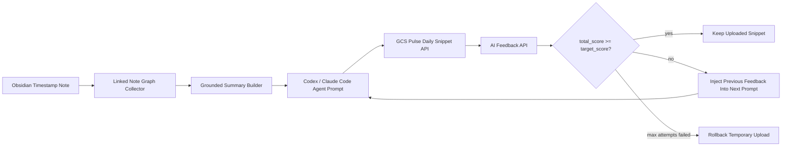

# GCS Pulse Daily Snippet Agent Automation

## 1. One Line Summary

GCS Pulse API와 웹 스니펫 기능을 직접 구현한 뒤, Codex와 Claude Code 에이전트를 이용해 Obsidian 일기 데이터를 매일 구조화된 Daily Snippet으로 업로드하고, 서버의 AI 피드백 점수가 목표치에 도달할 때까지 자동으로 개선하는 피드백 루프를 구축했다.

## 2. Project Pitch For AI Screening

이 프로젝트는 단순한 일기 업로드 자동화가 아니라, API 명세 기반 백엔드와 웹 인터페이스 위에 에이전트 자동화 루프를 얹은 실험이다. 사용자의 Obsidian 메모 그래프를 수집하고, 원문을 그대로 복사하지 않고 회고 템플릿에 맞게 요약한 뒤, GCS Pulse Daily Snippet API로 생성 또는 업데이트한다. 이후 서버의 AI Feedback API가 반환하는 `total_score`와 세부 평가 항목을 읽고, 목표 점수 이상이 나올 때까지 이전 피드백을 다음 작성 프롬프트에 반영해 재시도한다.

핵심은 "AI가 대신 글을 써준다"가 아니라, "AI가 평가 기준을 읽고, 근거 자료를 보존하며, 품질 기준을 통과할 때까지 반복 개선하는 자동화 시스템"을 만든 것이다.

## 3. Problem

매일 작성하는 회고는 꾸준히 쌓이면 강력한 학습 데이터가 되지만, 실제로는 다음 문제가 있었다.

- Obsidian에 남긴 원문 메모와 GCS Pulse에 업로드할 구조화된 회고 형식이 달랐다.
- 웹에서 직접 작성하면 반복 입력 비용이 크고, 하루를 빠뜨리기 쉬웠다.
- AI 피드백 점수는 있었지만, 점수를 보고 다시 고치는 과정이 수동이었다.
- 좋은 회고의 기준이 감각에 머물러 있어, `record_completeness`, `learning_signal_detection`, `cause_effect_connection`, `action_translation`, `learning_attitude_consistency` 같은 평가 항목과 연결된 자동 개선 루프가 필요했다.

## 4. Solution

GCS Pulse의 Daily Snippet API와 AI Feedback API를 자동화 파이프라인으로 연결했다.



자동화는 매일 23:55에 실행되도록 등록할 수 있으며, 수동 실행과 dry run도 지원한다.

## 5. API Surface Used

OpenAPI 명세 기준으로 Daily Snippet 생성 요청은 `content` 문자열 하나를 받는다. 자동화는 이 단순한 API를 단독 호출하지 않고, 조회, 생성, 수정, 삭제, 정리, 피드백을 하나의 상태 관리 흐름으로 묶었다.

| Capability | Endpoint | Method | Purpose |
|---|---:|---:|---|
| Daily list | `/daily-snippets` | `GET` | 특정 날짜의 기존 스니펫 존재 여부 확인 |
| Daily create | `/daily-snippets` | `POST` | 오늘 스니펫이 없을 때 새로 생성 |
| Daily update | `/daily-snippets/{snippet_id}` | `PUT` | 오늘 스니펫이 있을 때 내용 업데이트 |
| Daily delete | `/daily-snippets/{snippet_id}` | `DELETE` | 실패한 신규 업로드 롤백 |
| Daily organize | `/daily-snippets/organize` | `POST` | 원문을 구조화된 스니펫 초안으로 정리 |
| Daily feedback | `/daily-snippets/feedback` | `GET` | 업로드된 스니펫의 AI 분석 및 점수 생성 |
| Weekly equivalents | `/weekly-snippets/*` | mixed | 동일 패턴을 주간 회고에도 확장 |

CLI 클라이언트는 `Authorization: Bearer <api_token>` 방식으로 서버를 호출하며, JSON 응답을 파싱해 자동화 루프의 상태 판단에 사용한다.

## 6. Uploaded Snippet Contract

최종 업로드 콘텐츠는 원문 덤프가 아니라 아래 순서의 구조화된 회고 섹션만 포함한다.

```markdown
## what
## why
## highlight
## lowlight
## Feeling
## Insight
## To Do
## Team add
## Score
```

중요한 제약은 다음과 같다.

- Obsidian 원문과 연결 노트만 근거로 사용한다.
- 웹 URL이나 비마크다운 첨부 파일은 그래프 수집 대상에서 제외한다.
- 최종 업로드에는 `원문 기록` 섹션을 넣지 않는다.
- 빈 메모 그래프에서는 임의의 일을 만들어내지 않고, 빈 상태 처리 규칙을 따른다.
- 점수를 높이기 위해 사실을 추가하지 않는다.

## 7. Feedback Rubric

GCS Pulse Daily Feedback API는 100점 만점의 JSON 피드백을 반환한다.

| Metric | Max Score | Meaning |
|---|---:|---|
| `record_completeness` | 15 | 회고 항목이 성실하고 구체적인가 |
| `learning_signal_detection` | 25 | 의미 있는 배움의 단서를 포착했는가 |
| `cause_effect_connection` | 20 | 행동, 결과, 이유, 배움이 논리적으로 연결되는가 |
| `action_translation` | 20 | 오늘의 배움이 다음 행동으로 번역되는가 |
| `learning_attitude_consistency` | 20 | 회고 태도와 지속성이 드러나는가 |

자동화의 기본 목표 점수는 `total_score >= 90`이다. 서버의 업적 판정 로직도 `total_score`를 파싱해 90점 이상 여부를 판단한다.

## 8. Automation Workflow

1. Obsidian 설정에서 열린 vault를 찾는다.
2. `Timestamp/<yy.mm>/**` 경로에서 대상 날짜의 노트를 찾는다.
3. frontmatter의 `date` 값을 우선 사용하고, 없으면 `<dd>.md` 파일명으로 fallback한다.
4. `[[wikilink]]`와 로컬 Markdown 링크를 따라 재귀적으로 연결 노트를 수집한다.
5. 수집한 노트에서 H1 섹션과 본문 요약을 추출한다.
6. Codex 또는 Claude Code 에이전트가 GCS Pulse Daily Snippet 형식에 맞는 초안을 만든다.
7. 같은 날짜의 기존 스니펫을 조회한다.
8. 기존 스니펫이 있으면 update, 없으면 create를 호출한다.
9. Daily Feedback API를 호출해 `total_score`와 항목별 점수를 읽는다.
10. 목표 점수 미만이면 이전 피드백을 다음 프롬프트에 넣어 다시 작성한다.
11. 목표 점수에 도달하면 업로드를 유지한다.
12. 최대 시도 횟수 안에 목표 점수에 도달하지 못하면 임시 업로드를 롤백한다.

## 9. Agentic Loop Design

이 프로젝트의 중요한 설계 포인트는 에이전트를 한 번 호출하는 것이 아니라, 서버의 실제 피드백을 다음 프롬프트의 입력으로 재사용하는 폐쇄 루프를 만든 점이다.

```yaml
loop_input:
  source: Obsidian linked note graph
  constraints:
    - no raw dump
    - no fabricated work
    - fixed section order
  server_feedback:
    - total_score
    - rubric_scores
    - mentor_comment
    - next_action
loop_decision:
  pass_condition: total_score >= target_score
  retry_condition: total_score < target_score
  rollback_condition: max_attempts_reached and score_gate_enabled
```

이 방식은 프롬프트 엔지니어링, API 통합, 자동 상태 관리, 실패 복구를 하나의 제품 경험으로 연결한다.

## 10. Evidence From Runs

자동화 로그에서 목표 점수까지 반복 개선된 사례가 확인된다. 개인 일기 원문은 포트폴리오에 포함하지 않고, 점수 변화만 증거로 남긴다.

| Date | Upload Action | Attempts | Score Progression | Result |
|---|---|---:|---|---|
| 2026-04-18 | created | 4 | 84 -> 87 -> 89 -> 90 | target reached |
| 2026-04-19 | created | 4 | 85 -> 84 -> 89 -> 91 | target reached |
| 2026-04-22 | created | 4 | 88 -> 88 -> 87 -> 92 | target reached |
| 2026-04-18 | updated | 4 | 72 -> 79 -> 83 -> 86 | rollback after failure |
| 2026-04-19 | updated | 4 | 76 -> 84 -> 89 -> 83 | rollback after failure |

이 로그는 목표 점수 게이트, 반복 시도, 실패 시 롤백이 실제로 동작했음을 보여준다.

## 11. Web Implementation Context

GCS Pulse 웹에서는 Daily Snippet 화면을 별도로 제공한다.

- `/daily-snippets` 페이지에서 Daily Snippet 작성과 조회를 처리한다.
- `SnippetPageClient`는 daily/weekly 공통 화면 로직을 사용한다.
- 작성 화면은 save, organize, feedback 생성을 연결한다.
- organize와 feedback은 streaming 응답을 처리할 수 있다.
- `SnippetAnalysisReport`는 `total_score`, 항목별 점수, 핵심 배움, 다음 행동, 멘토 코멘트를 시각화한다.

즉, 이 자동화는 웹 없이 별도로 떠 있는 스크립트가 아니라, 이미 구현된 API와 웹 사용자 경험을 에이전트가 매일 사용할 수 있도록 확장한 것이다.

## 12. Backend Implementation Context

서버는 Daily Snippet에 대해 다음 책임을 가진다.

- CRUD API 제공
- 동일 날짜 스니펫 조회와 페이지 데이터 제공
- AI 기반 organize API 제공
- AI 기반 feedback API 제공
- streaming 응답 지원
- 피드백 JSON을 스니펫에 저장
- 90점 이상 점수 기반 업적 판정 지원

Pydantic 스키마는 `DailySnippetCreate`, `DailySnippetUpdate`, `DailySnippetResponse`, `DailySnippetFeedbackResponse`로 분리되어 있고, 피드백은 JSON 문자열 또는 구조화된 JSON으로 파싱되어 프론트엔드와 자동화 루프에서 재사용된다.

## 13. What Makes This Project Distinct

- API 명세를 읽고 실제 REST API를 서비스 내부 기능으로 구현했다.
- 웹 UI에서 사람이 쓰는 기능을 CLI와 에이전트가 반복 실행할 수 있게 만들었다.
- 에이전트가 작성한 결과를 서버의 AI 평가 모델로 다시 평가하고, 그 결과를 다음 작성에 반영했다.
- 단순 자동 업로드가 아니라 품질 기준을 통과할 때까지 개선하는 루프를 만들었다.
- 실패 시 원래 상태를 되돌리는 롤백 로직을 포함했다.
- Obsidian의 링크 그래프를 활용해 하루의 문맥을 수집하되, 민감한 원문을 그대로 업로드하지 않는 제약을 넣었다.

## 14. Skills Demonstrated

```yaml
backend:
  - REST API design
  - FastAPI router/schema implementation
  - AI feedback endpoint design
  - structured JSON contract design
frontend:
  - Next.js page composition
  - reusable daily/weekly snippet views
  - streaming AI response handling
  - feedback score visualization
automation:
  - CLI integration
  - scheduled execution
  - Obsidian note graph parsing
  - retry loop and rollback design
ai_engineering:
  - grounded summarization
  - rubric-aware prompting
  - feedback-driven prompt iteration
  - agent workflow orchestration with Codex and Claude Code
product_thinking:
  - habit automation
  - reflective learning analytics
  - human-in-the-loop quality gates
  - privacy-aware diary transformation
```

## 15. Resume Bullets

- Built an agentic Daily Snippet automation pipeline that reads Obsidian notes, structures them into a fixed reflection format, uploads them through the GCS Pulse REST API, and retries with AI feedback until the server score reaches the configured target.
- Implemented and integrated Daily/Weekly Snippet API flows across FastAPI backend, Python CLI, and Next.js web UI, including organize, feedback, CRUD, streaming responses, and score visualization.
- Designed a feedback-driven loop where Codex and Claude Code agents use server rubric output to improve generated reflections while preserving grounding constraints and rollback safety.

## 16. Short Korean Portfolio Copy

GCS Pulse API 명세를 기반으로 Daily/Weekly Snippet API와 웹 작성 화면을 구현하고, 이를 Codex와 Claude Code 에이전트가 매일 사용할 수 있는 자동화 파이프라인으로 확장했다. Obsidian에 작성한 일기와 연결 노트를 수집해 정해진 회고 형식으로 요약하고, GCS Pulse에 업로드한 뒤 AI 피드백 점수가 90점 이상이 될 때까지 이전 피드백을 반영해 재작성한다. 목표 점수에 도달하면 업로드를 유지하고, 실패하면 임시 변경을 롤백한다. 이 프로젝트를 통해 API 통합, 웹 구현, 에이전트 워크플로, 피드백 기반 자동 개선 루프를 하나의 제품 경험으로 연결했다.

## 17. Keywords

AI agent, Codex, Claude Code, FastAPI, Next.js, REST API, OpenAPI, Obsidian automation, reflection analytics, feedback loop, prompt engineering, rubric-aware generation, SSE streaming, CLI automation, Windows Task Scheduler, portfolio project
